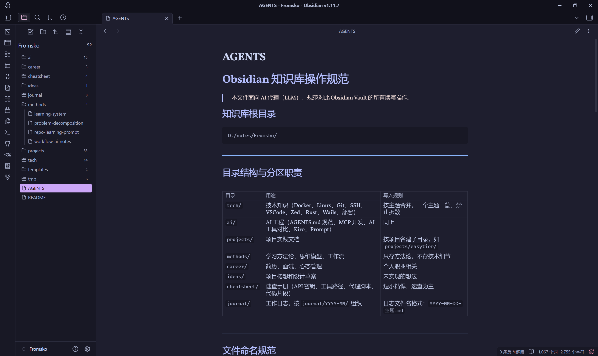
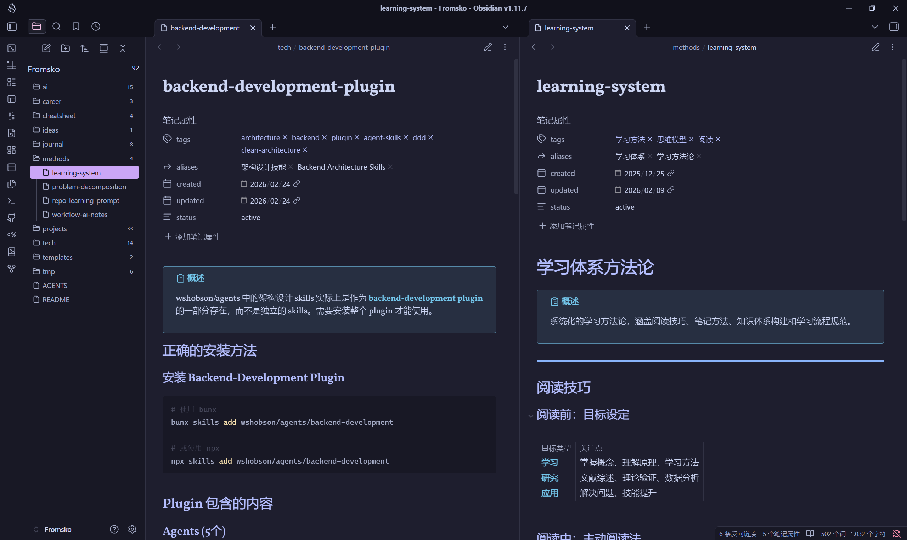

# Obsidian Rust MCP

[中文文档](./README_CN.md)

A high-performance MCP (Model Context Protocol) server for Obsidian knowledge base management, built with Rust.

## Features

- 📂 **File Tree Indexing** - Get complete vault structure and tag overview
- 🔍 **Smart Search** - Query notes by tags, exact name, or fuzzy keyword matching
- 📝 **Note Management** - Read and write notes with automatic frontmatter generation
- 🏷️ **Tag System** - Organize notes with tags and aliases
- ⚡ **High Performance** - Built with Rust for speed and reliability

## Installation

```bash
cargo build --release
```

## Usage

The server provides the following MCP tools:

### `note_index_tree`
Get the complete file tree and all available tags in your vault.

### `query_note`
Search notes using:
- **Tags**: Filter by one or more tags (intersection)
- **Exact name**: Match exact filename (without .md)
- **Keyword**: Fuzzy search across filenames, aliases, and tags

Example:
```json
{"tags": ["docker"]}
{"exact_name": "docker-guide"}
{"keyword": "Docker"}
{"tags": ["rust"], "keyword": "mcp"}
```

### `read_note`
Read the complete content of a note by its relative path.

Example:
```json
{"path": "tech/docker-guide.md"}
```

### `write_note`
Create or append to notes with automatic frontmatter generation.

Example:
```json
{
  "directory": "tech",
  "filename": "nginx-guide",
  "tags": ["nginx"],
  "aliases": ["Nginx Guide"],
  "status": "active",
  "content": "> [!abstract] Overview\n> Content\n\n## Related Notes\n\n- [[docker-guide]]"
}
```

### `write_note_tips`
Get the complete writing guidelines for the vault (directory structure, naming conventions, frontmatter format, etc.).

## Configuration

### Option 1: Environment Variable (Recommended)
Set the `OBSIDIAN_VAULT_ROOT` environment variable to point to your Obsidian vault:

```bash
# Linux/macOS
export OBSIDIAN_VAULT_ROOT="/path/to/your/vault"

# Windows (cmd)
set OBSIDIAN_VAULT_ROOT=D:\notes\Fromsko

# Windows (PowerShell)
$env:OBSIDIAN_VAULT_ROOT="D:\notes\Fromsko"
```

### Option 2: Hardcoded Path
Edit the `VAULT_ROOT` constant in `src/main.rs`:

```rust
const VAULT_ROOT: &str = r"D:\notes\Fromsko";
```

### Option 3: MCP Client Configuration (Recommended for MCP clients)
Configure the vault path directly in your MCP client configuration:

```json
{
  "fromsko-note": {
    "command": "/path/to/obsidian-mcp",
    "disabled": false,
    "env": {
      "OBSIDIAN_VAULT_ROOT": "/path/to/your/vault"
    }
  }
}
```

Replace `/path/to/obsidian-mcp` with the actual path to your compiled binary, and `/path/to/your/vault` with your Obsidian vault path.

**Note**: This is the recommended approach when using this MCP server with clients like Claude Desktop, Cursor, or other MCP-compatible tools.

## Valid Directories

Notes can be organized in the following directories:
- `tech` - Technical notes
- `ai` - AI/ML related notes
- `projects` - Project documentation
- `methods` - Methodologies and processes
- `career` - Career development
- `ideas` - Ideas and brainstorming
- `cheatsheet` - Quick reference guides
- `journal` - Daily journals

## Screenshots

### Agent Integration


### Note Example


## License

MIT - see [LICENSE](./LICENSE) file for details.
