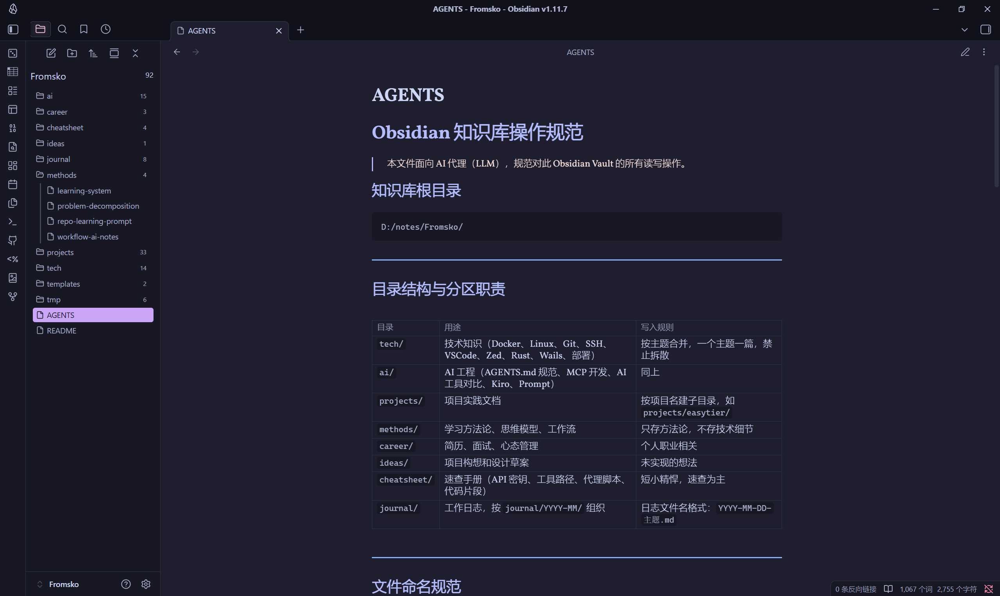

<!--
```yaml
project: Obsidian Rust MCP
description: 基于 Rust 构建的高性能 Obsidian 知识库 MCP 服务器
language: Rust
version: 0.3.0
author: Fromsko
email: fromsko@example.com
license: MIT
keywords:
  - MCP
  - Obsidian
  - Rust
  - 知识管理
  - 模型上下文协议
  - 笔记管理
  - 文件树索引
  - 智能搜索
  - 标签系统
  - 高性能
repository: https://github.com/fromsko/obsidian-rust-mcp
documentation: https://github.com/fromsko/obsidian-rust-mcp/blob/main/README_CN.md
```
-->


# Obsidian Rust MCP

[English](./README.md)

基于 Rust 构建的高性能 Obsidian 知识库 MCP（模型上下文协议）服务器。

## 功能特性

- 📂 **文件树索引** - 获取完整的知识库结构和标签概览
- 🔍 **智能搜索** - 通过标签、精确文件名或模糊关键词查询笔记
- 📝 **笔记管理** - 读写和删除笔记，自动生成 Frontmatter
- 🔄 **追加或覆盖** - 可选择追加模式（默认）或覆盖模式
- 📁 **子目录支持** - 在嵌套目录中组织笔记（如 `projects/easytier`、`journal/2026-03`）
- 🛡️ **输入校验** - 目录白名单、文件名过滤、路径穿越防护
- 🏷️ **标签系统** - 使用标签和别名组织笔记
- ⚡ **高性能** - 使用 Rust 构建，速度快且可靠

## 安装

```bash
cargo build --release
```

## 迁移说明（v0.3 Breaking Change）

**MCP 对外仅保留两个工具**：`help`、`executeCommand`。

以下旧工具名已**移除**，请勿再调用：

| 旧工具（v0.2 及以前） | v0.3 替代方式 |
|----------------------|---------------|
| `write_note_tips` | `executeCommand` → `obsidian.guide` |
| `query_note` | `executeCommand` → `obsidian.search` |
| `write_note` | `executeCommand` → `obsidian.write` |
| `read_note` | `executeCommand` → `obsidian.read` |
| `note_index_tree` | `executeCommand` → `obsidian.index` |
| `delete_note` | `executeCommand` → `obsidian.delete` |

典型流程：**`help` → `obsidian.guide` → `obsidian.search` →（可选 `obsidian.read`）→ `obsidian.write`**

## 使用方法（CLI 模型 — v0.3）

MCP 仅暴露 **两个工具**，减少客户端 token 占用：

| 工具 | 作用 |
|------|------|
| `help` | 命令手册（短目录或详细说明） |
| `executeCommand` | 执行已注册的 `obsidian.*` 命令 |

### `help`

```json
{}
```

```json
{ "topic": "obsidian.write", "detail": true }
```

### `executeCommand`

```json
{
  "command": "obsidian.search",
  "args": { "tags": ["docker"], "keyword": "nginx" }
}
```

```json
{
  "command": "obsidian.write",
  "args": {
    "directory": "tech",
    "filename": "nginx-guide",
    "tags": ["nginx"],
    "aliases": ["Nginx 指南"],
    "status": "active",
    "content": "Markdown 正文（不含 frontmatter）",
    "append": true
  }
}
```

### 已注册命令（`obsidian.*`）

| 命令 | 说明 |
|------|------|
| `obsidian.guide` | 知识库写入规范（首次写入前建议执行） |
| `obsidian.search` | 按标签 / 关键词 / 精确名搜索（可选 `include_index`） |
| `obsidian.write` | 创建或追加笔记（`append` 默认 `true`） |
| `obsidian.read` | 按路径读取全文（高级） |
| `obsidian.index` | 全库文件树 + 标签统计（高级） |
| `obsidian.delete` | 删除笔记（见 `help` + `detail`） |

架构说明见 [docs/arch.md](./docs/arch.md)，路线图见 [docs/todo.md](./docs/todo.md)，Agent 技能见 `.cursor/skills/obsidian-vault-mcp/`。

## 配置

### 选项 1：环境变量（推荐）
设置 `OBSIDIAN_VAULT_ROOT` 环境变量指向您的 Obsidian 知识库：

```bash
# Linux/macOS
export OBSIDIAN_VAULT_ROOT="/path/to/your/vault"

# Windows (cmd)
set OBSIDIAN_VAULT_ROOT=D:\notes\Fromsko

# Windows (PowerShell)
$env:OBSIDIAN_VAULT_ROOT="D:\notes\Fromsko"
```

### 选项 2：硬编码路径
编辑 `src/config.rs` 中的 `VAULT_ROOT` 常量：

```rust
pub const VAULT_ROOT: &str = r"D:\notes\Fromsko";
```

### 选项 3：MCP 客户端配置（推荐用于 MCP 客户端）
在您的 MCP 客户端配置中直接设置知识库路径：

```json
{
  "fromsko-note": {
    "command": "/path/to/obsidian-mcp",
    "disabled": false,
    "env": {
      "OBSIDIAN_VAULT_ROOT": "/path/to/your/vault"
    }
  }
}
```

将 `/path/to/obsidian-mcp` 替换为编译后的二进制文件实际路径，将 `/path/to/your/vault` 替换为您的 Obsidian 知识库路径。

**注意**：当与 Claude Desktop、Cursor 或其他 MCP 兼容工具一起使用时，这是推荐的方法。

## 有效目录

笔记可以组织在以下顶级目录中（支持子目录，最多 3 层）：
- `tech` - 技术笔记
- `ai` - AI/机器学习相关笔记
- `projects` - 项目文档
- `methods` - 方法论和流程
- `career` - 职业发展
- `ideas` - 想法和头脑风暴
- `cheatsheet` - 快速参考指南
- `journal` - 日常日志

## 项目结构

```
src/
  main.rs           # 二进制入口
  lib.rs
  server.rs         # MCP：help + executeCommand
  command/          # 注册表、help 渲染、分发
  service/          # 知识库业务逻辑
  store/            # LocalVault + VaultBackend（预留云端）
  config.rs
  types.rs
  validation.rs
  frontmatter.rs
  index.rs
  file_tree.rs
tests/
  service_integration.rs
  mcp_stdio.rs
  registry.rs
docs/arch.md
docs/todo.md
```

## 测试

```bash
cargo test   # 单元 + 集成 + MCP stdio
```

## 截图

### 代理集成


### 笔记示例


## 许可证

MIT - 详见 [LICENSE](./LICENSE) 文件。
